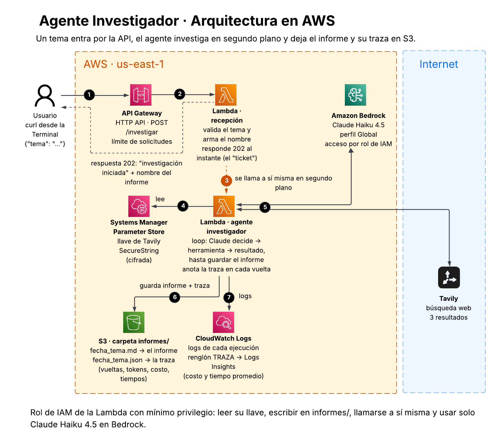

# Agente Investigador 🔎

Agente de IA que recibe un tema, busca en la web, resume la información y guarda un informe estructurado.

## Fases del proyecto

- [x] **Fase 1:** Agente funcionando en local
- [x] **Fase 2:** Desplegado en AWS (Lambda + API Gateway + S3)
- [x] **Fase 3:** Observabilidad (trazas, herramientas usadas, tokens y costo)
- [x] **Fase 4:** Claude a través de Amazon Bedrock (sin llave de Anthropic)

## Requisitos

- macOS
- [Homebrew](https://brew.sh)
- Python 3.12
- API key de [Anthropic](https://console.anthropic.com)
- API key de [Tavily](https://tavily.com)

## Instalación

1. Instalar Homebrew:
```bash
   /bin/bash -c "$(curl -fsSL https://raw.githubusercontent.com/Homebrew/install/HEAD/install.sh)"
```
2. Agregar `brew` al PATH:
```bash
   echo 'eval "$(/opt/homebrew/bin/brew shellenv)"' >> ~/.zprofile
```
3. Instalar Python 3.12:
```bash
   brew install python@3.12
```
4. Crear el entorno virtual e instalar dependencias:
```bash
   python3.12 -m venv .venv
   source .venv/bin/activate
   pip install -r requirements.txt
```

## Cómo usarlo

### En local (mi Mac)

```bash
python agente.py "el tema que quieras investigar"
```

El informe se guarda en la carpeta `informes/`.

### En la nube (AWS)

En varios renglones:

```bash
curl -X POST https://<MI-API>.execute-api.us-east-1.amazonaws.com/investigar \
  -H "Content-Type: application/json" \
  -d '{"tema": "el tema que quieras"}'
```

O en un solo renglón:

```bash
curl -X POST https://<MI-API>.execute-api.us-east-1.amazonaws.com/investigar -H "Content-Type: application/json" -d '{"tema": "el tema que quieras"}'
```

La API responde al instante con el nombre del informe, y el agente trabaja en segundo plano. El informe se guarda en S3, en la carpeta `informes/`.

## Arquitectura en AWS



1. El usuario manda el tema con `curl`.
2. API Gateway pasa la solicitud a la Lambda.
3. La Lambda responde al instante y se llama a sí misma en segundo plano.
4. Lee la llave cifrada de Tavily en Parameter Store.
5. Investiga con Claude en Amazon Bedrock (piensa y escribe) y Tavily (busca en la web).
6. Guarda el informe `.md` y su traza `.json` en S3.
7. Deja los logs en CloudWatch, incluido un renglón `TRAZA` para los reportes.

## Observabilidad

Cada investigación guarda una **traza** en S3, al lado del informe y con el mismo nombre, pero `.json`. Por cada vuelta registra:

- segundos que tardó Claude
- tokens de entrada y salida, y costo en USD
- herramientas usadas, qué buscó y cuánto tardó cada una

También guarda los totales (vueltas, búsquedas, tokens, costo y segundos) y el estado (`ok` o `error`).

### Optimización encontrada con las trazas

La primera traza mostró una vuelta extra **después** de guardar el informe, solo para que Claude dijera "listo". Esa vuelta reenviaba todo el informe y costaba ~27% del total. Ahora el agente termina en cuanto guarda el informe.

| | Antes (4 vueltas) | Después (3 vueltas) | Cambio |
|---|---|---|---|
| Costo promedio por informe | $0.0274 | $0.0214 | **−22%** |
| Tokens de entrada promedio | 12,989 | 7,689 | **−41%** |
| Segundos promedio | 34.7 | 33.9 | −2% |

*Medido con CloudWatch Logs Insights: 1 informe antes y 4 después.*

### Reporte de costo (CloudWatch Logs Insights)

Grupo de logs: `/aws/lambda/agente-investigador`

```
filter @message like /TRAZA/
| parse @message /"vueltas": (?<vueltas>\d+)/
| parse @message /"tokens_entrada": (?<entrada>\d+)/
| parse @message /"costo_usd": (?<costo>[\d.]+)/
| parse @message /"segundos": (?<segundos>[\d.]+)/
| stats count() as informes, avg(costo) as costo_promedio, sum(costo) as costo_total, avg(entrada) as tokens_entrada_promedio, avg(segundos) as segundos_promedio by vueltas
```

## Fase 4: Claude a través de Amazon Bedrock

El agente en AWS ya no usa la API de Anthropic directamente: llama a Claude Haiku 4.5 **a través de Amazon Bedrock**.

- **Sin llave de Claude:** la Lambda entra a Bedrock con su **rol de IAM**, igual que a S3. Se eliminó esa credencial de Parameter Store.
- **Mínimo privilegio:** el rol solo puede usar `bedrock:InvokeModel` con Claude Haiku 4.5. Cualquier otro modelo queda bloqueado.
- **Cambio mínimo de código:** se usa `AnthropicBedrock` de la misma librería de Anthropic, así que el loop, las herramientas y la traza no cambiaron.

**Decisión: perfil de inferencia Global vs. US.** Elegí **Global** porque da más disponibilidad y mejor precio, y este proyecto no maneja datos sensibles. En una empresa con requisitos de residencia de datos (banca, gobierno, salud) se elegiría **US**, para que los datos se procesen solo en regiones de Estados Unidos.

### Comparación con trazas (mismo tema)

| | Anthropic directo | Amazon Bedrock |
|---|---|---|
| Vueltas / búsquedas | 3 / 5 | 3 / 5 |
| Tokens de entrada | 7,014 | 7,106 |
| Tokens de salida | 2,570 | 2,703 |
| Costo (calculado) | $0.0199 | $0.0206 |
| Tiempo total | 31.8 s | 32.2 s |

Mismo comportamiento y mismo rendimiento. La pequeña diferencia viene de que el informe salió un poco más largo, no del proveedor.
